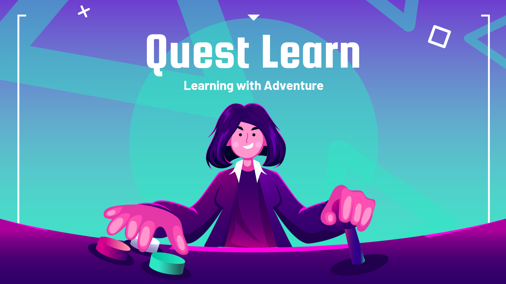
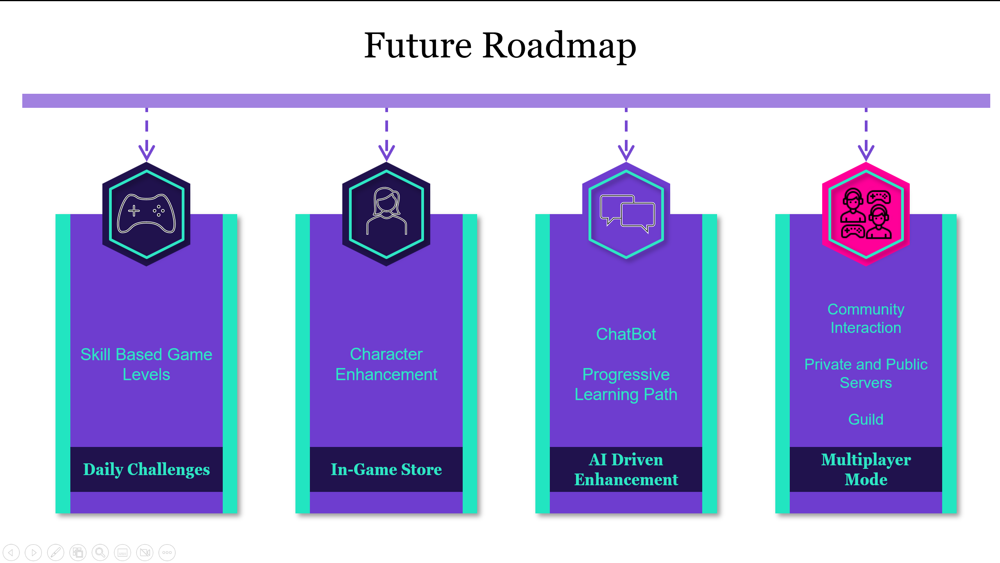

# GameBasedLearningApp
Developed an engaging, interactive game-based learning website aimed at addressing monotony and limited interactivity in traditional learning methods. The platform integrates puzzles and challenges designed to boost critical thinking and problem-solving, with users earning "Haki" rewards to unlock hints and progress through levels. The solution includes real-time progress tracking, instant feedback, and a leaderboard to encourage friendly competition. The app’s anime-based theme capitalizes on the $31 billion global anime market (2023), making learning more relatable.

Technologies Used: HTML, CSS, JavaScript, Python, Flask

